# lost-canary 

#### Author: spicypete

```
Damn, I lost my canary at one of the train stations. Can you help me find it?

ncat --ssl lost-canary.chal.uiuc.tf 1337
```

```
Handout:    
ld-2.31.so
lost_canary
Makefile
libc-2.31.so
Dockerfile
```

**tl; dr:**
- Reverse to find unique function not containing bad stack canary 
- Libc leak using format string vulnerability in printf
- ROP chain to get shell 


## Step 1: Initial Analysis 
Okay, we have quite an interesting handout for your average RE challenge. Makefile, libc, linker and Dockerfile? 

Oh yeah, this is also a pwn challenge. :)

I like to get as many ideas/as much information as I can from everything *about* or surrounding the challenge as I can, as it usually gives me ideas on what to look for when I start the actual analysis process on the binary. 

So, keeping that in mind, let us first inspect the handout files other than the binary itself.

```
$ cat Dockerfile
FROM ubuntu:20.04 as chroot
FROM gcr.io/kctf-docker/challenge@sha256:eb0f8c3b97460335f9820732a42702c2fa368f7d121a671c618b45bbeeadab28

COPY --from=chroot / /chroot
RUN mkdir -p /chroot/home/user
COPY ./lost_canary /chroot/home/user
COPY ./flag.txt /chroot/

COPY nsjail.cfg /home/user/

CMD kctf_setup && \
   kctf_drop_privs \
  socat \
     TCP-LISTEN:1337,reuseaddr,fork \
     EXEC:"kctf_pow nsjail --config /home/user/nsjail.cfg -- /home/user/lost_canary"
```

Okay, this tells us there is a flag.txt file in the server, which gives us multiple methods of approaching this challenge already. We can narrow down this funnel as we further progress with the challenge, finalising on one approach in the end. 


Next up, let us look at the Makefile
```
$ cat Makefile
main:
        python3 gen-canary.py
        gcc -O0 program.c -std=gnu99 -fno-stack-protector -Wno-deprecated-declarations -o lost_canary
```

What we see aligns with the name of the challenge as well. We can see that the challenge binary was compiled with the `-fno-stack-protector` option, what does that do?

Well, before we discuss that I think a small refresher on the stack would be nice. 

### A Stack Refresher
(I will be using `x86_64` as an example to explain)

The stack is used to store local variables (on a per-function basis) during program runtime. 

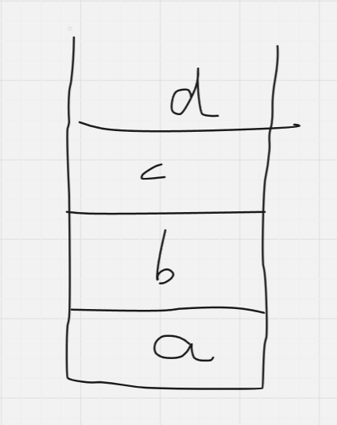

It is also important to clarify the difference between 2 terms: "stack space" and "stack frame". 

Stack space is the space allocated by your OS for your current program, there is one stack space assigned per program, which is some amount of space in the RAM.

Stack frame is the "stack" structure itself which is used up per-function in your program - each function has its own stack frame. 
Stack frames are constructed and destructed for every function that executes, and there can only be ONE stack frame in the current context at any given time. That means, only one stack pointer (`rsp` in x86-64), which points to the top of the stack - whichever is in the current context, and one base pointer (`rbp` in x86-64), which points to the base of the stack in the current context. 


So, if each function needs to have its own frame, we need a way to save each function's base and top pointers, right?


First, let us look at how a normal stack looks for a regular function (say `main()`)

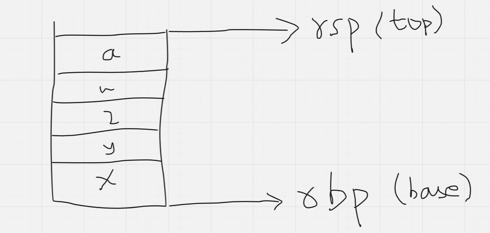

(In actuality, the stack grows *downwards* in memory, i.e, the stack pointer is the one moving down when the base pointer stays constant above it, but I am just drawing it this way for easier visualisation)

Okay, now we need to see how each function can maintain it's own stack frame while the overall program still uses only 2 pointers - one for the current stack top and another for the current stack base. 

Let us see how `x86-64` handles this. 

(I am assuming at least basic assembly knowledge at the time of writing this)

Okay, let us say we are in main, with source code as follows: 

```c
#include <stdio.h>

int main(int argc, char *argv[]) 
{
    int x = 5;
    int y = 7;

    /* Assume find_sum() is defined somewhere in the program */
    find_sum(x, y);

    return 0;
}
```

At the line of the call to `find_sum()`, the stack would have some values (these depend on the compiler you are using, but not of our concern anyways - what we are bothered with is the top and base pointers). Let us see the stack right *before* the call to `find_sum()`:

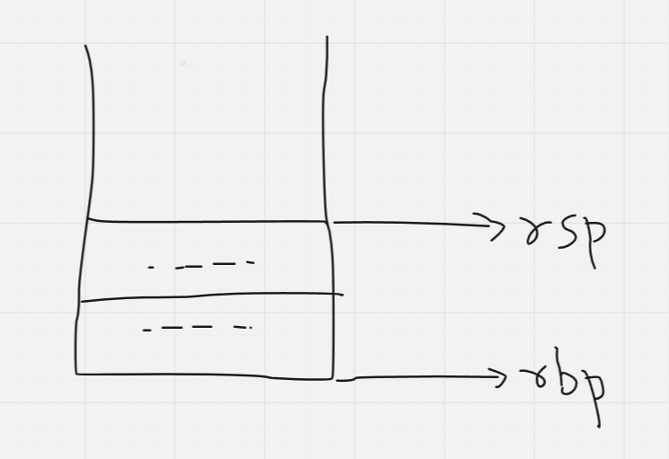

(**Note**: The `rsp` and `rbp` only *point* to the top and bottom, they do not contain the values at the bottom/top of the stack - those can be gotten by dereferencing these pointers)

So, the next line is our function call, let us see what happens. 

First off, every function call is translated into assembly as a `call` instruction, which transfers control flow to a different part of the code. 

```asm
# something like this
mov rdi, 5
mov rsi, 7
call find_sum

# remaining instructions in the program 
mov eax, 0
leave 
ret
```

We can see that there are also instructions after the call instruction, so once the different part of the code finishes executing, control flow would need to return to the next instruction (`mov eax, 0`, in our case). 

Luckily for us, we have a register which tracks the address of the next instruction: `rip`. Let us use that. 

To store `rip` temporarily, we can push it onto the stack. 

The `call` instruction in `x86-64` is actuall abstracted into 2 separate instructions: `push rip` and `jmp rip`, so the control flow of our program is transferred there. 

Currently, our stack looks like this:

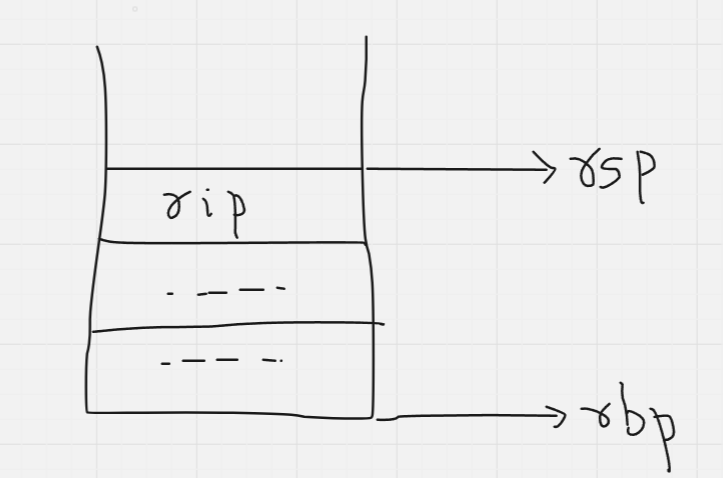

Now, what Intel does here is interesting. 

First, the old *value* of `rbp` is pushed onto the stack

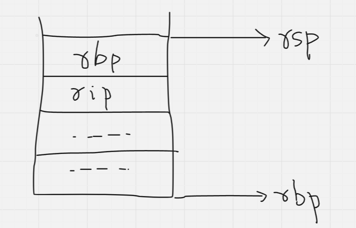

Now that the old `rbp` value is safe, the current top, is set as the new base (i.e, `rsp` and `rbp` now contain the same values, effectively pointing to the same address). 

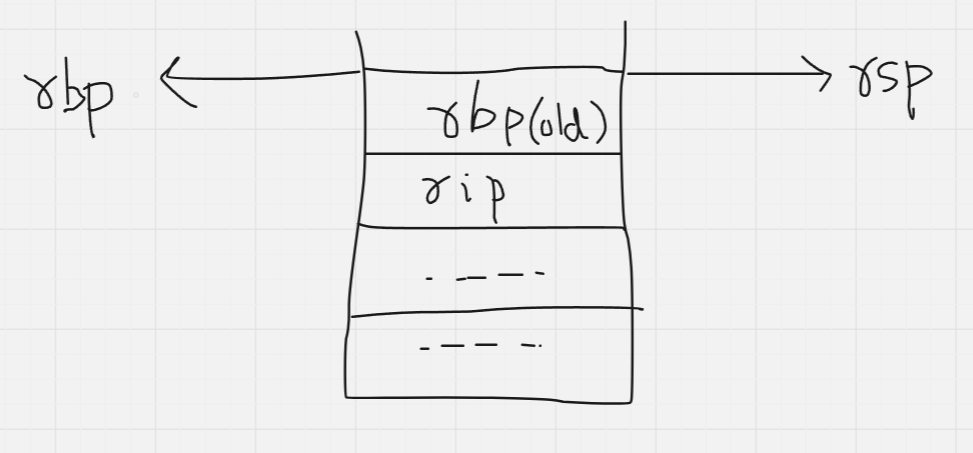
And now, the stack for the new function is set up! The function is free to use its frame however it pleases (as long as it does not use up all the stack space allocated by the OS!). 

If we had to put what I just showed in pictures and translate it to assembly, it would look a little something like this: 

```
# save the old value of rbp on the stack
push rbp 

# rbp = rsp, effectively setting the new "base" to the previous "top"
mov rbp, rsp
```

Now, logically, returning from a function would follow the opposite steps as setting up a stack frame for a function. 

First, the stack top pointer is brought down to the current base (opposite of what happened for setting up)

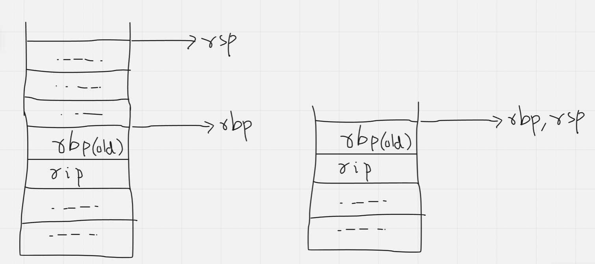


Next, the top value on the stack (which was the old base pointer) is popped into `rbp`. This effectively moves the base pointer back to where it previously was. 

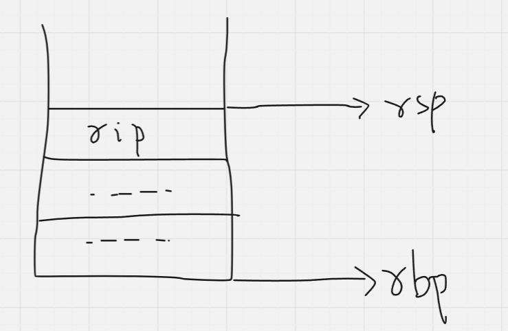

Next, the top value on the stack (which was the old value of `rip`), is popped into `rip` (this is abstracted as the instruction: `ret`). 

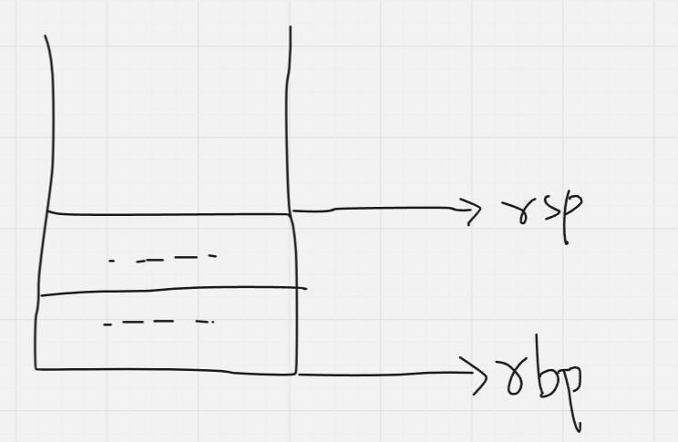

And that's how it's done! 

This is how you can use just 2 pointers to effectively have however many stack frames you want (1 per function). 

Now, back to the challenge :)

## Analysis: continued

The `-fno-stack-protector` turns off the option to add a stack protection mechanism known as the "stack cookie" or the "stack canary". Why does the stack need protection, though? 

Well, we have seen that, during a function call, the stack stores 2 critical values: the old base pointer (`rbp`) and the return address from where code flow needs to continue after the function call (`rip`). What if I can overwrite these values? 

What if there are some library functions (for example: `gets`), which use the stack as a buffer to store the value we give it, but do not perform any bound/size checks, and will accept any length of input and place it as it is on the stack? `gets` is one such example of a library function which does not care about the size of the input you give it, it will eat up as many characters as you give it. 

This effectively means I can overwrite the `rip` with whatever value I want, meaning I control the flow of execution of the program going forward.


A stack canary is a kind of boundary wall that is used to prevent such attacks. It is a random value that is generated each time the program is run, and placed between the old `rbp` and any value(s) the function uses the stack for storing. So the new stack looks a little something like this: 

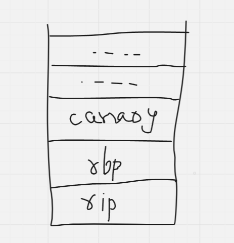

The value of this canary is checked to see if it it was overwritten with something else. If it is not what it's supposed to be, the program simply exits. It is difficult (but not impossible in some cases), to beat this. 

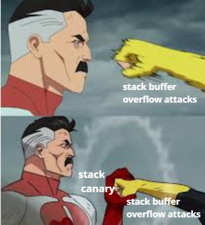

Next up, `-Wno-deprecated-declarations` - this just tells the compiler to keep quiet and not warn about any deprecated function(s) we might be using in our program. 


## Step 2: Program Analysis

Before we try running the program, we need to make sure the binary is patched to refer to the linker and libc that we have been given in the handout. Luckily, there is a very handy tool for doing just this: [pwninit](https://github.com/io12/pwninit).

Just install and run `pwninit` from the challenge directory and it will do the patching for you, and will generated a separate patched file, with the needed changes. 

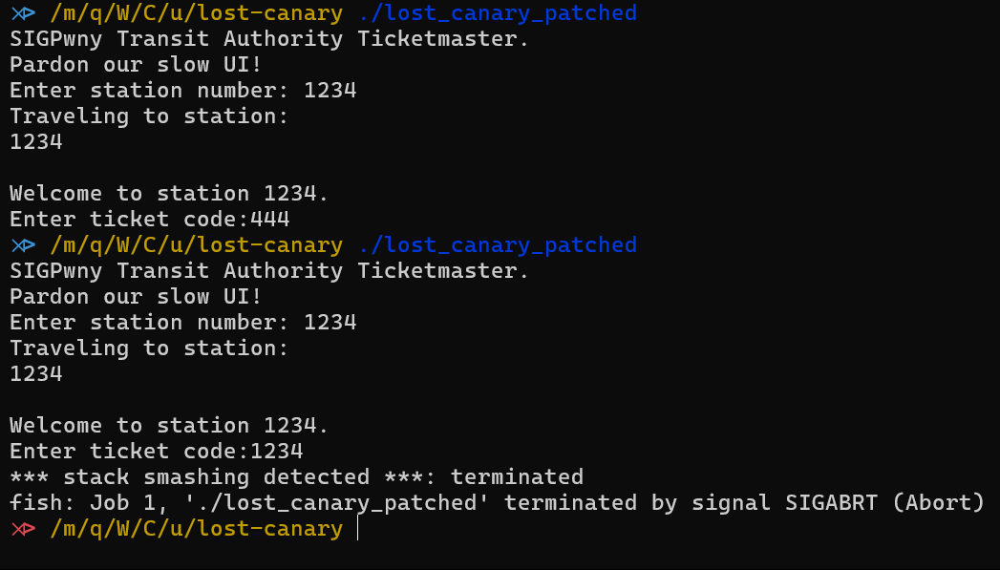

This is what we get from running the binary a couple of times, let us open it up in IDA. 

Immediately, we can see a bunch of `station_<number>` functions, probably the function that gets called based on the station number we input, and it gets there using a `jmp` table. You can tell this because of the `__asm { jmp     rax }` that IDA has placed in the pseudocode. You can recover any jump table in IDA if you notice this by following this [blog](https://hex-rays.com/blog/igors-tip-of-the-week-53-manual-switch-idioms/).

In the `select_station` function itself, we can see there is a call to `printf` with the input that we give to the program. This is a format string vulnerability. 

### What is a format string vulnerability?

In assembly, there is something known as a "calling convention". This refers to the places where any function looks at first when it is called, to know what arguments were passed to it. 

In `x86-64` the calling convention is as follows: `rdi`, `rsi`, `rdx`, `rcx`, `r8`, `r9`. If a function has more arguments than this, the stack is used for the remaining ones. 

This just means that, printf (and all other functions) will look at these registers in these order, followed by the stack to know what it has to print out to the console. 

Now in our program, the printf call is vulnerable because it does not inherently control how many values it prints out. Compare the following 2 printf calls:
```
printf("%s", arg);

printf(arg);
```

The first one is alright, because there is only 1 format specifier passed when `printf()` is called, and we cannot change that, but the second one is vulnerable - in the sense, we can print out however many values we want, in whatever format we want. 

Before we get to exploiting this format string vulnerability, we also need to identify vulnerable functions, so how do we pick that? 

## Step 3: Reversing

A little analysis shows us that there exist 3 different kind of functions, functions that: 

1. Take ticket code through `gets()`
2. Take ticket code through `fgets()`, then use `strcpy()` to copy it elsewhere
3. Take ticket code through `scanf()`

All 3 have some or the other kind of BOF (buffer overflow) vulnerability, but there is one thing to keep in mind about each function here: 

1. `gets()` stops taking input at the first newline (`0xa`)
2. `scanf()` stops taking input at the first whitespace character in general 
3. `strcpy()` stops at the first null byte 

(I kind of guessed that `gets()` would be the vulnerable function, it as well as could have been any other, in which case my script can be easily modified, but oh well)

Let us pick a random `gets()` function and examine it. 

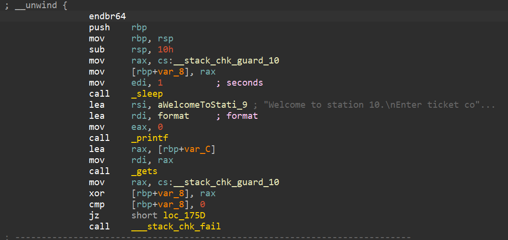

Seems pretty straightforward, except one thing: a predefined stack canary is being loaded, not by the compiler. Meaning, we have all the stack canary values already, we would not need to spend timing finding/leaking it :)

Of course, the author would not want things to be this easy, so let us examine the canary as well

```
__stack_chk_guard_10 = 0x456B0A4E4C74784F
```

Ahh, there is a newline in there. 

This is an issue because, if we do end up exploiting the buffer overflow vulnerability in `gets()`, we would need to keep the canary intact so as to not have the program detect an overwrite and exit. 
To do this, we would need to pass the canary as part of the input, and doing that would prematurely end the `gets()` function since there is also a newline in the canary. 

Examining a couple more stations shows us that this is the case for every `gets()` function so far, as well as `scanf()` and `strcpy()` functions

So, we need to find a single function where this is not the case. For this, we can utilise IDA scripting with the IDAPython API. 

Here is the general idea:

1. Generate a list of all functions calling `gets()`
2. Generate a list of all stack canaries without a newline
3. Compare to see if there are common functions between the two lists 

So let us write a script to do just that.

```py
import idautils
 
def find_xrefs_to(address):
    '''
    given an address, find all addresses calling that address
    '''

    xrefs = []
    for ref in idautils.CodeRefsTo(address, 0):
        xrefs.append(ref)
    return xrefs


def get_stack_canaries():
    '''
    given the base address, generate a dictionary of in the format 
    {station_number: canary_value} 
    if the canary does not contain a newline  
    '''

    data_addr = 0x555555C13010
    canaries = []

    dicky = {}
    for i in range(32767):
        canary = idaapi.get_bytes(i * 8 + data_addr, 8)
        if b"\x0a" not in (canary):
            dicky[i] = canary
                 
    return dicky

def get_func_names(xrefs):

    '''
    given all addresses calling _gets, 
    generate a list of all the station numbers 
    '''

    calling_func_names = []
    for i in xrefs:
        func_name = idaapi.get_func(i)
        func_addr = func_name.start_ea
        calling_func_names.append(func_addr)

    return calling_func_names
def main():
    # address of the label _gets
    gets_addr = 0x555555555180

    # generate list of all addresses calling _gets
    xrefs = find_xrefs_to(gets_addr)
    
    
    # get the names of all the functions calling _gets
    calling_gets = get_func_names(xrefs)
    
    # get list of all the stack canaries not containing a newline
    canaries = get_stack_canaries()
    
    # retrieve just station numbers
    station_numbers = canaries.keys()
    
    # find out if any address lies in both generated lists
    for i in station_numbers:
        func_name = "station_" + str(i)
        addr = idaapi.get_name_ea(0, func_name)        
        if addr in calling_gets:
            print(hex(addr))
        
main()
```

And the output of this script gives us the address of `station_14927`: the vulnerable one. 

## Step 4: Exploiting 

Now that we have the vulnerable function, let us get down to exploiting it. From the Dockerfile we saw earlier, the idea is to get a shell and do `cat flag.txt`, so let's see how we can do it. 

Back to the format string vulnerability. 

We know the `printf()` in `select_station` is vulnerable, and we know why. Let us view the register state before the `printf()` call in `select_station`

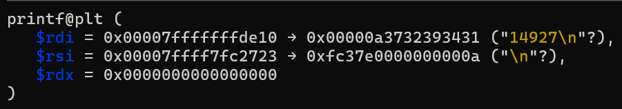

Running `info proc mappings` on GDB tells us what is mapped to where in virtual memory, so we can make use of that here

We can see that the address that `rsi` contains is actually a LIBC address! 

We can assume ASLR is on for this program.

One interesting thing to note about ASLR is that while it does modify the actual addresses of variables and functions in your program, it usually does not touch the distance between these variables (this distance is also known as an "offset"). 

For example, if we run a program for the first time, and a variable `x` is at address `0x1000`, and a variable `y` is at `0x1050`, and we run this program for a second time, we would see that the address of the variable `x` has now changed to `0x1450`, but `y` remains a constant offset from it at `0x14a0`. 

This is because it would take way too long for ASLR to randomise the locations of *every* single variable in a given program. What is does instead is randomise the *base* address of various memory mappings, one of which is LIBC. 

We can utilise this fact to find the base address of `libc` every time the program is run. This is known as a `ret2libc` attack

There are 4 main steps to `ret2libc` attacks:
1. Find an address that points to something in the libc by using something like a format string vulnerability
2. Use the address above to calculate the base address of libc 
3. Calculate addresses of any libc functions we like using the base address 
4. Use a different exploit (BOF in our case) to overwrite the return address with the libc function we would like to jump to 


Let us leak an address as an example, by running the program with the input "14927-%p-"

The output I get is: `0x7ffff7fc2723`

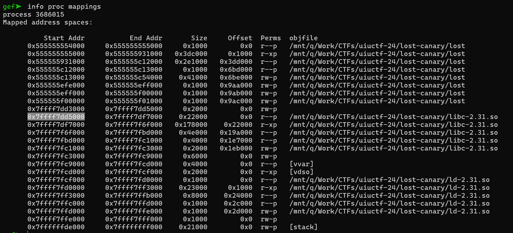

All I have to do, is subtract the base address of the `libc` I have (highlighted in the screenshot), from it, to get the constant offset difference, which comes out to be: `0x1ed723`. I can use this information to get the base address of the libc every time the program is run now, through the format string vulnerability in `main()`.

