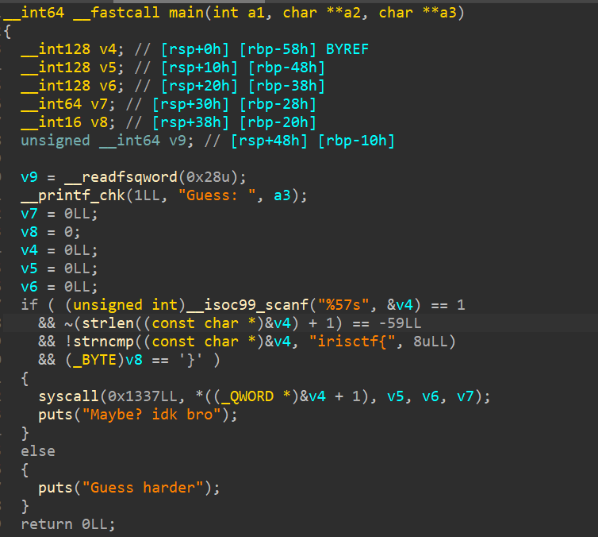
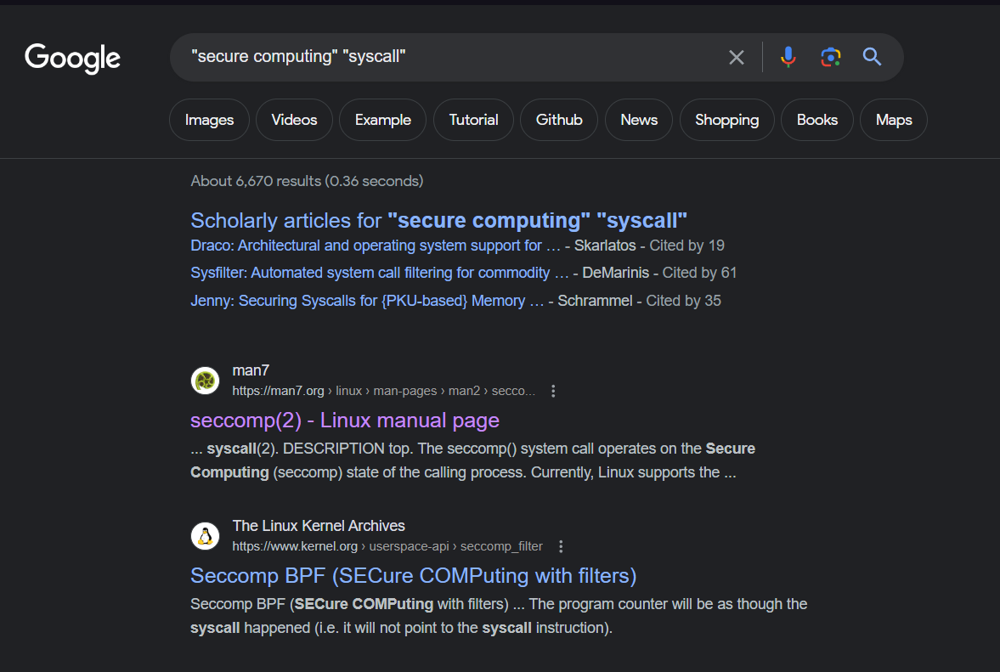
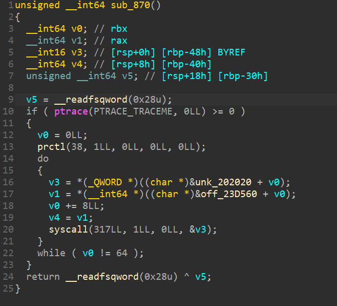
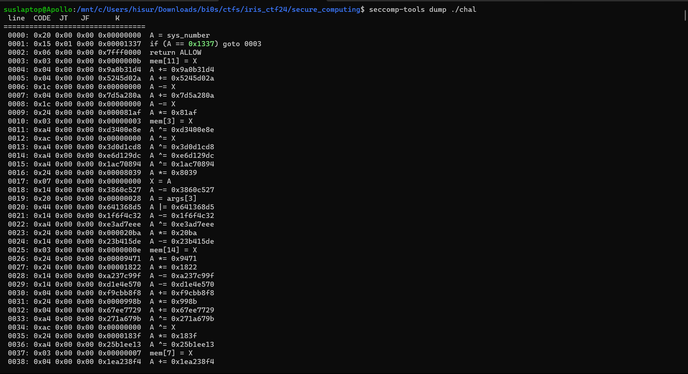
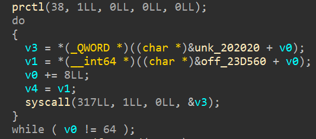

# Secure Computing - IrisCTF24 Writeup
```
Your own secure computer can check the flag! Might have forgotten to add the logic to the program, but I think if you guess enough, you can figure it out. Not sure
```


The description seems to hint at something related to "secure computing", and so does the challenge name. Interesting, we shall see. 

## Understanding the challenge
Opening the file up in IDA, we see this 




It's passing our input (flag) as arguments to a syscall, in the form of 6 Qwords.
Calling syscall *0x1337* seems a little odd - because it obviously does not [exist](https://chromium.googlesource.com/chromiumos/docs/+/master/constants/syscalls.md) - so what's going on here?

A quick google search with select keywords seems to point us in a single direction 




<br>

The man page of the `seccomp` syscall gives us this
```
The seccomp() system call operates on the Secure Computing (seccomp) state 
of the calling process.
```
**What does that mean?**

## Understanding Seccomp
Seccomp (or Secure Computing) is a security feature in the Linux kernel that provides an additional layer of protection for applications by restricting the system calls that they make. System calls are the interface between user-space applications and the kernel, allowing programs to request services from the operating system. 

Some important (and interesting) features of Seccomp: 
- It allows you to define a filter that specifies which system calls are permitted for a particular process. By default, all syscalls are allowed, but with seccomp, you can create a "policy" that restricts this set. 
-  It uses BPF (Berkeley Packet Filter), which is a virtual machine that can execute a set of instructions to filter system calls. Think of BPF as a "javascript for your kernel", because it resides in a VM on the kernel and responds to specific events that occur on the system to which it is attached. The filters are written using BPF assembly or even C, which are then compiled to BPF bytecode. 
-  It offers mainly 2 modes of operation - *strict* & *filter*. In strict mode, the process starts with a seccomp filter in place, and any attempt to make an unallowed system call results in the termination of the process. Whereas in filter mode, the filter is applied only when explicitly requested by the process (we will look at the "how" of this later).


Looking for syscalls with the calling number `317` (seccomp's syscall number), we find this




Hmm, let's look at the arguments passed to it
The prototype of the seccomp syscall looks like this: 
```
syscall(SYS_seccomp, unsigned int operation, unsigned int flags, void *args);
```

Here, it seems like `operation` is set to 1
```
The system calls allowed are defined by a pointer to a Berkeley Packet 
Filter (BPF) passed via args.  This argument is a pointer to a struct 
sock_fprog; it can be designed to filter arbitrary system calls and 
system call arguments.  If the filter is invalid, seccomp() fails,
returning EINVAL in errno.
```

```
In order to use the SECCOMP_SET_MODE_FILTER operation, either the calling 
thread must have the CAP_SYS_ADMIN capability in its user namespace, or the 
thread must already have the no_new_privs bit set.  If that bit was not 
already set by an ancestor of this thread, the thread must make the following
call:

    prctl(PR_SET_NO_NEW_PRIVS, 1);
```

Both of these are being done in our binary. Let us see what the man page says about those BPF instructions containing the actual filters for our input, which will allow us to solve the challenge.

```
When adding filters via SECCOMP_SET_MODE_FILTER, args points to a filter
program:

   struct sock_fprog {
       unsigned short      len;    /* Number of BPF instructions */
       struct sock_filter *filter; /* Pointer to array of
                                      BPF instructions */
   };

Each program must contain one or more BPF instructions:

   struct sock_filter {            /* Filter block */
       __u16 code;                 /* Actual filter code */
       __u8  jt;                   /* Jump true */
       __u8  jf;                   /* Jump false */
       __u32 k;                    /* Generic multiuse field */
   };
```

Found our instructions!
So now our approach would be to extract these instructions and disassemble the BPF bytes to see if we can make sense of the filter and reverse it. But let's see if any tool exists that can already do it for us, just to make our lives a little easier :) 

Another quick google search leads us to [seccomp-tools](https://github.com/david942j/seccomp-tools), something that exactly matches the description of what we're looking for. 

To extract the filters from the binary, we simply run:
```sh
seccomp-tools dump ./chal
```

But doing this yields no result, why's that? 
Reading the GitHub page of seccomp-tools, we can see this
```
Dumps the seccomp BPF from an execution file. This work is done by utilizing 
the ptrace syscall.
```
And we have a ptrace syscall in our binary, which is obviously causing the issue - so let's patch that out. 

Now running seccomp-tools:


Bingo!

But one thing we have to keep in mind, is the loop in which `seccomp` is being called. Note that it is not just one filter being set, it is *eight* of them.



`v0` is acting as the loop constraint here, making it run for 8 times, meaning 8 filters being set. 
To dump all 8 filters, we can use the `-l` flag with seccomp-tools.
And to clear out all the other garbage being printed along with the output, we can use a little bit of bash. 

```bash=
seccomp-tools dump ./chal -l 8 | grep -v "=======|CODE" | cut -d" " -f7- > disasm.txt
```

Now that we have all 8 filters in a single file, time to solve for the constraints. 


## Solving the challenge 

Looking at the file (and from the challenge, too), we can see that we'll have 6 QWORDS to input, which it checks and returns `KILL` if it's wrong and `ERRNO(0)` if it's correct. 
First thing that comes to mind is z3, so let's go for that. 

Here is my script to parse the file and add constraints and "emulate" the filter on my args

```py
from z3 import *

# solver
s = Solver()
INT_BITS = 32

def getFlag(model):
    flag = ''
    for i in range(6):
        t = model[args[i]].as_long()
        flag += bytes.fromhex(hex(t)[2:]).decode()[::-1]
        t = model[args2[i]].as_long()
        flag += bytes.fromhex(hex(t)[2:]).decode()[::-1]
    
    print(f"[+] Flag: irisctf{{{flag}}}")


# using BitVecVals instead of python integers because 
# they act like a "constant symbol", and automatically get 
# truncated according to size, etc 
A = BitVecVal(0, INT_BITS)
X = BitVecVal(0, INT_BITS)
sys_number = BitVecVal(0x1337, INT_BITS)
arch = BitVecVal(0xc000003e, INT_BITS)

# splitting our qwords into pairs of dwords, higher and lower 
# since bpf uses only 32-bit integers at a maximum anyways 
args = []
args2 = []

# zero initialised since mem is being initialised in the program 
mem = [0] * 16
       
# args is lower DWORD
for i in range(6):
    x = BitVec(f"args[{i}]", 32)
    args.append(x)
    for j in range(0, 32, 8):
        s.add(Extract(j + 7, j, x) >= 32)
        s.add(Extract(j + 7, j, x) <=127)

# args2 is higher DWORD 
for i in range(6):
    x = BitVec(f"args2[{i}]", 32)
    args2.append(x)
    for j in range(0, 32, 8):
        s.add(Extract(j + 7, j, x) <= 127)
        s.add(Extract(j + 7, j, x) >= 32)


with open("disasm.txt") as disassembly:
    for line_number, line in enumerate(disassembly):
        line = line.strip()
        
        # ignore all return and kill statements, not needed for our solver
        if "return" in line:
            continue
        
        elif " >> " in line: # upper DWORD being extracted
            line = line.replace(" >> 32", "").replace("args", "args2 ")
            
        # lines where constraint for our input comes in 
        if "goto" in line:
            temp_line = line.split()
            lhs = temp_line[1][1:]
            rhs = temp_line[3][:-1]
            rhs = eval(rhs)
            s.add(A == rhs)
            continue

        exec(line)

        # if A is an integer and not a BitVector, make sure it is 
        # within the 32-bit limit 
        if type(A) == int:
            A = A % (2 ** INT_BITS)
    

assert s.check() == sat
model = s.model()

getFlag(model)
```


That's one way to solve it, but one way doesn't cut it, does it? 


After the CTF, I came across [Klee](https://klee.github.io). Klee, you could say, is a Symbolic Virtual Machine (Solver), that allows you to symbolically execute a C source file. This is advantageous for 2 main reasons:

- You don't have to bother about having to convert C source to Python (to have to apply Z3 on it to solve symbolically)
- While converting from C to Python, we don't have to worry about stuff like signedness and typecasting :\)


Klee is a symbolic execution engine that explores program paths symbolically, treating variables as symbols rather than with concrete values. It is built on top of the LLVM compiler infrastructure, so this integration allows it to work easily with programs written in C/C++, and leverage LLVM capabilities for program analysis and transformation. 


#### **Install Klee** 
Install [Docker](https://docs.docker.com/engine/install/) (since that is what I used to run Klee on this)
 
```bash=
docker pull klee/klee
docker run --rm -ti --ulimit='stack=-1:-1' klee/klee
```

#### **Convert C source to Bitcode** 
(Bitcode is the format of code that Klee operates on. It is the LLVM IR representation of the code used by compiler chains like `clang`)
```bash=
clang -emit-llvm -c <filename>.c
klee <filename>.bc
```

This will generate a directory with a number (indicating the number of times you've run Klee on the file so far), `klee-last` is the directory with the information on the file that was last symbolically executed with Klee.

```bash=
ls klee-assert/ | grep assert 
ktest-tool klee-latest/<files_output_from_previous_command>
```

The files are output in a format `test<number>.assert.err`. 

To run Klee on your C-source, simply run
```bash=
ktest-tool klee-last/test<number>.ktest
```


**To generate the filter.c files to run using Klee, you can do the following**: 
```bash=
seccomp-tools dump ./chal -l 8 > full_disasm.txt
```
<br>

Followed by a script to split these files and parse them, then convert them to C files in the format the Klee expects
```py
# split the large output into 8 separate files properly 
def split_files(filename):
    with open(filename, "r") as f:
        disassembly = f.readlines()

    LINES_PER_FILE=3797
    i = 0
    for line in disassembly:
        if (i % LINES_PER_FILE == 0):
            # open the next file to disassemble 
            file_number = i // LINES_PER_FILE
            if (i != 0):
                f.close()
                f = open(f"disassembly_{file_number}.txt", "w")
            else:
                f = open(f"disassembly_{file_number}.txt", "w")
        f.write(' '.join(line.split()[5:]) + '\n')
        i += 1  

program_head = """
#include <stdint.h>
#include <stdbool.h>
#include <stdlib.h>

#include <assert.h>
#include "klee/klee.h"

#define ERRNO(x) (x)
#define KILL 2
#define ALLOW 1

#define EM_X86_64 62
#define __AUDIT_ARCH_64BIT 0x80000000
#define __AUDIT_ARCH_LE 0x40000000
#define AUDIT_ARCH_X86_64 (EM_X86_64 | __AUDIT_ARCH_64BIT | __AUDIT_ARCH_LE)
"""

prog_main = """
int main(int argc, char * argv[]) {
    uint64_t args[6];
    klee_make_symbolic(args, sizeof(args), "args");
    uint8_t result = filter(args);
    // Did the filter return zero?
    klee_assume(result == 0);
    // If we reach this point, we found a solution
    klee_assert(0);
    return 0;
}

"""

function_init = """
uint8_t filter(uint64_t args[6]) {
    // initialize memory and registers
    uint32_t A = 0;
    uint32_t X = 0;
    // fix architecture and syscall number
    uint32_t sys_number = 0x1337;
    uint32_t arch = AUDIT_ARCH_X86_64;

    uint32_t mem[16] = {0};
    [FUNCTION BODY]
}
"""

# return the line number that control flow will go to, given a line
def goto_target(line: str):
    line = line.split()
    return line[5]


# generate function body 
# need to keep track of line number, starting from 1, to insert goto_label into line
def parse_disassembly(disassembly):    
    c_code = ""
    for line_number, line in enumerate(disassembly):
        line_number += 1  # line number is normally zero-indexed
        # if line has a goto statement, most important 
        if "goto" in line:
            # store line number and insert "LABEL_" + line_number + "_" in next line 
            goto_line = goto_target(line)
            # insert label
            c_code += line.replace(str(goto_line), f"LABEL_{goto_line}")
            c_code += "LABEL_" + goto_line + ": "
        else:
            c_code += line 

    return c_code 


def main():
    split_files("full_disasm.txt")
    # iterate through all the disassembly files to parse out 
    for file_number in range(0, 8):
        with open(f"disassembly_{file_number}.txt", "r") as f:
            disassembly = f.readlines()

        c_code = parse_disassembly(disassembly)
        
        with open(f"filter_{file_number}.c", "w") as f:
            program = program_head + "\n\n" + function_init.replace("[FUNCTION BODY]", c_code) + prog_main 
            f.write(program)

if __name__ == "__main__":
    main()
```
